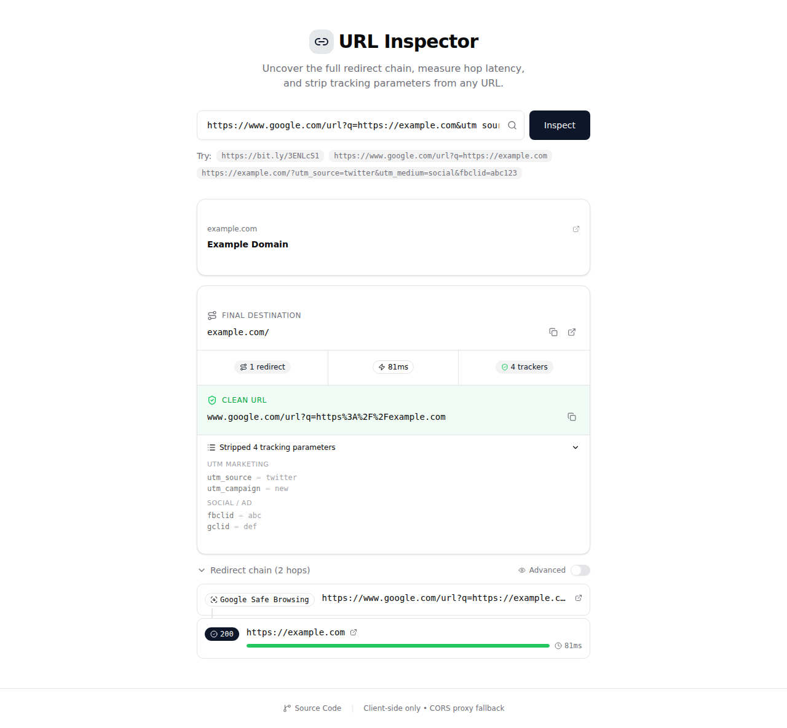

# 🔗 URL Inspector

**Live demo:** [aieatassam.github.io/url-inspector](https://aieatassam.github.io/url-inspector/)

Inspect URL redirect chains, measure hop latency, strip tracking parameters, and preview link destinations — all client-side, no backend required.



## Features

- **Redirect Chain Trace** — follows each hop in a redirect chain, including URL wrappers (Google Safe Browsing, Facebook Link, Reddit Outbound)
- **Per-Hop Latency** — measures timing for each redirect with color-coded visual bars
- **Tracking Parameter Stripper** — cleans URLs of `utm_*`, `fbclid`, `gclid`, `tag`, and 40+ trackers (UTM, Social, Ad, Analytics, Affiliate, Matomo)
- **Categorized Tracker Breakdown** — see exactly which tracking params were stripped, grouped by category
- **Open Graph Preview** — fetches OG/Twitter Card metadata from the final destination (title, description, image, favicon)
- **Proxy-Resolved Redirects** — when CORS blocks direct inspection, extracts the real destination URL from the proxy response HTML
- **Tiered Information** — basic summary by default, advanced mode for response headers and status meanings
- **Copy Clean URL** — one-click copy of both final and clean URLs
- **Zero Account Required** — all data stays in your browser

## Tech Stack

- React 19
- TypeScript 6
- Vite 8
- Tailwind CSS 4
- shadcn/ui (Radix primitives)
- Deployed on GitHub Pages

## Development

```bash
npm install
npm run dev
```

## Testing

```bash
# Run tests
npm test

# Run with coverage
npm run test:coverage
```

## Deployment

The site auto-deploys via GitHub Actions on push to `main`.

To deploy manually:

```bash
npm run deploy
```

## How URL Inspection Works

1. The browser sends a `fetch` request with `redirect: 'manual'`
2. If a `3xx` response is returned, we read the `Location` header and follow
3. Known URL wrappers (Google, Facebook, Reddit) are detected and the real destination is extracted from query params
4. Each hop's timing is measured with `performance.now()`
5. If CORS blocks direct inspection, we fall back to a public CORS proxy ([codetabs](https://api.codetabs.com))
6. The proxy response is parsed for `og:url` or canonical URL to determine the real destination
7. Tracking parameters are detected, counted by category, and a clean URL is offered

## Supported Tracking Parameters

| Category | Parameters |
|---|---|
| UTM Marketing | `utm_source`, `utm_medium`, `utm_campaign`, `utm_term`, `utm_content` |
| Social / Ad | `fbclid`, `gclid`, `gclsrc`, `dclid`, `gbraid`, `wbraid`, `msclkid`, `twclid`, `igshid` |
| Google Analytics | `_ga`, `_gl` |
| Google Ads | `gad_source`, `gad_campaign`, `gad` |
| HubSpot | `_hsenc`, `_hsmi`, `hsCtaTracking` |
| Mailchimp | `mc_cid`, `mc_eid` |
| Affiliate | `tag`, `linkCode`, `linkId` |
| Matomo Analytics | `mtm_source`, `mtm_medium`, `mtm_campaign`, `mtm_keyword`, `mtm_content`, `pk_source`, `pk_medium`, `pk_campaign`, `pk_keyword` |
| Pinterest | `epik` |
| Campaign Tracking | `CMP`, `cmp` (Guardian, news outlets) |
| Referral | `ref`, `source`, `si`, `s_kwcid`, `ef_id` |
| Ad Platform | `yclid`, `wickedid`, `trooptid` |
| Other | `s_cid`, `mkt_tok`, `vero_conv`, `vero_id` |

## License

MIT
